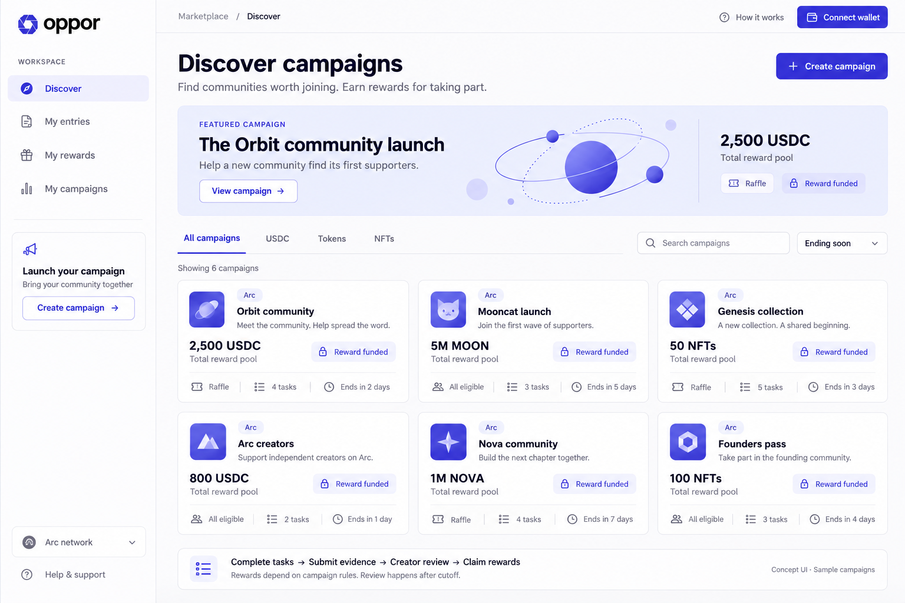

# Oppor — Indigo marketplace mockup

The selected direction is Indigo + Pearl. This version develops the earlier palette comparison into one complete desktop marketplace screen with a light sidebar, featured campaign, reward filters, search, and six campaign cards.

Generated with the built-in imagegen tool. The exact generation brief is saved in [INDIGO_MOCKUP_PROMPT.txt](INDIGO_MOCKUP_PROMPT.txt). This is a visual concept with fictional campaign data, not a running frontend or evidence of live campaigns.

## Color tokens

| Role | Token |
| --- | --- |
| Primary action | `#4338CA` |
| Active accent | `#4F46E5` |
| Canvas | `#FAFAFC` |
| Surface | `#FFFFFF` |
| Main text | `#18181B` |
| Secondary text | `#71717A` |
| Decorative border | `#E4E4E7` |
| Selected surface / funded badge | `#EEF2FF` |

Use these tokens as the implementation reference: generated raster colors are illustrative and may differ from the requested hex values. Green and teal are excluded, including status indicators and campaign artwork.

## Interface direction

- Neutral surfaces occupy most of the screen; indigo marks actions, selection, and the brand.
- Typography follows a clear page/title/reward/body/metadata hierarchy, with a Geist/Inter-style sans-serif.
- Cards share alignment and consistent spacing. Each shows the total reward pool, distribution mode, task count, and remaining time.
- Funded status describes deposited rewards; it does not certify the creator or guarantee an individual payout.
- The participant flow remains complete tasks → submit evidence → creator review → claim rewards. No automatic social verification or investment claims are shown.
- The image provides visual direction. Actual responsive behavior, keyboard interaction, contrast across component states, and wallet integration require frontend implementation.

The earlier [palette comparison](COLOR_PALETTE.md) remains available as design history.
