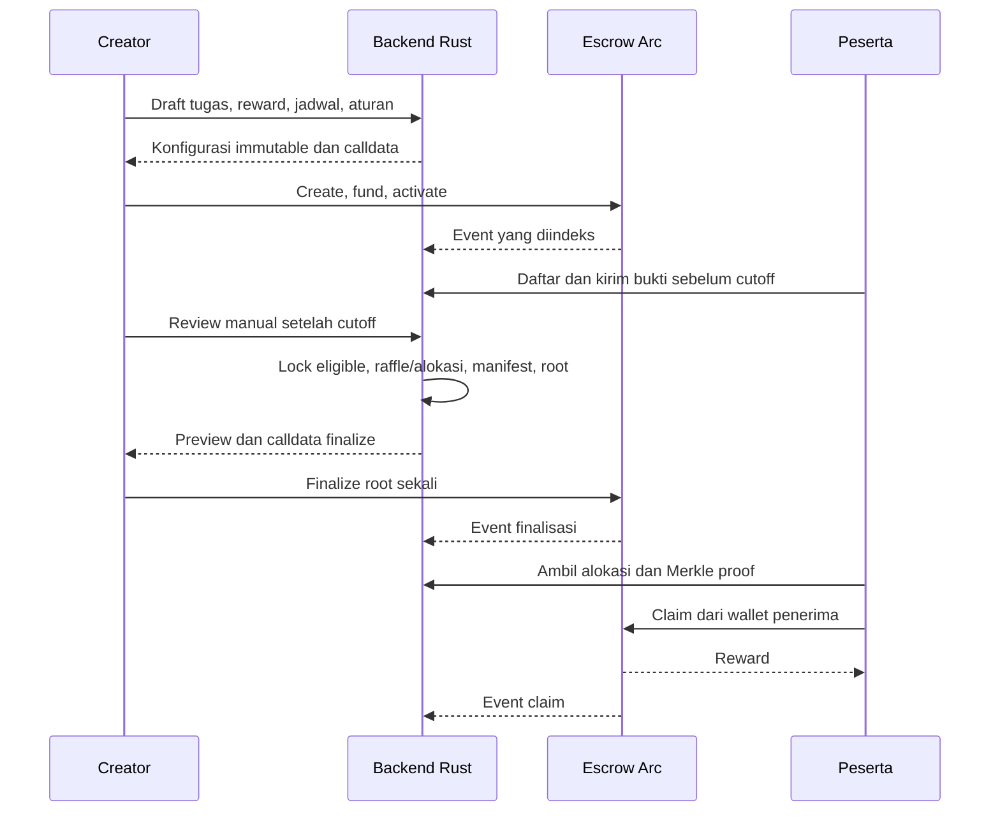

# Dokumentasi Teknis Oppor

Status: dokumen dalam folder ini merupakan spesifikasi awal. Backend yang sudah diimplementasikan, API aktual, batas keamanan, dan hasil pengujiannya ada di [backend/README.md](../backend/README.md). Implementasi factory/escrow dan pengujian Solidity tersedia di [contracts/README.md](../contracts/README.md); belum diaudit independen atau di-deploy ke Arc. Nama Oppor masih nama kerja.

## Dokumen

- [Proses bisnis](../BUSINESS_PROCESS.md): keputusan produk dan perjalanan creator/peserta.
- [Backend](BACKEND.md): Rust, Axum, SQLx, PostgreSQL, Redis, autentikasi, database, endpoint, worker, dan operasi.
- [Smart contract](SMART_CONTRACT.md): escrow Arc, pendanaan aset, finalisasi, Merkle claim, refund, dan invariant.
- [Integrasi dan pengujian](INTEGRATION_AND_TESTING.md): format data bersama, alokasi, raffle, transaksi, kasus gagal, dan acceptance criteria.

## Keputusan yang berasal dari pengguna

1. Marketplace campaign promosi token; creator menentukan reward dan tugas.
2. Tugas meliputi join Discord, repost, like, comment, tag, dan tugas custom.
3. Tidak memakai API X, termasuk API pihak ketiga. Pemeriksaan sosial dilakukan manual setelah cutoff.
4. Distribusi berupa raffle atau seluruh peserta memenuhi syarat.
5. Reward dapat berupa token creator, USDC/token lain, atau NFT.
6. Penerima melakukan claim sendiri dari escrow; distribusi bukan push ke semua peserta.
7. Backend memakai Rust, Axum, SQLx, PostgreSQL, dan Redis.

## Rancangan teknis yang direkomendasikan

Keputusan berikut dibuat agar spesifikasi bisa langsung dipakai mengimplementasikan produk. Ini rekomendasi, bukan persetujuan pengguna atas setiap detail:

- Satu aset ERC-20 atau satu koleksi NFT per campaign; reward gabungan menjadi perluasan berikutnya.
- NFT mencakup ERC-721 atau satu token ID ERC-1155.
- Factory membuat escrow terpisah per campaign, tanpa proxy upgradeable.
- Creator menandatangani transaksi pendanaan, aktivasi, dan finalisasi dari walletnya.
- Backend memverifikasi wallet, tidak menyimpan private key creator/peserta.
- Distribusi menggunakan Merkle root permanen dan satu transaksi claim per alokasi.
- PostgreSQL menjadi sumber kebenaran proses offchain; kontrak menjadi sumber kebenaran reward dan claim.
- Redis untuk cache dan rate limit; antrean pekerjaan tahan lama disimpan di PostgreSQL.
- Raffle awal menggunakan undian server yang dapat direproduksi, dengan batas kepercayaan yang dijelaskan. Tidak diklaim sebagai VRF atau randomness trustless.
- Tidak ada fee smart contract pada baseline. Harga layanan platform diputuskan terpisah.

## Alur utama

## Batas sistem

Escrow tidak menilai retweet, identitas X, atau keadilan review. Root membuktikan keanggotaan alokasi yang ditetapkan creator; root biasa tidak membuktikan seluruh total alokasi atau kelayakan sosial. Backend memeriksa manifest sebelum menawarkan finalisasi, tetapi creator tetap memiliki kewenangan onchain untuk menetapkan root.

Tanggal referensi: 9 Oktober 2026. Parameter Arc, RPC, chain ID, compiler, dan dependency harus diverifikasi serta dipin saat implementasi/deployment. Tidak ada alamat kontrak deployment Oppor dalam dokumen ini.
